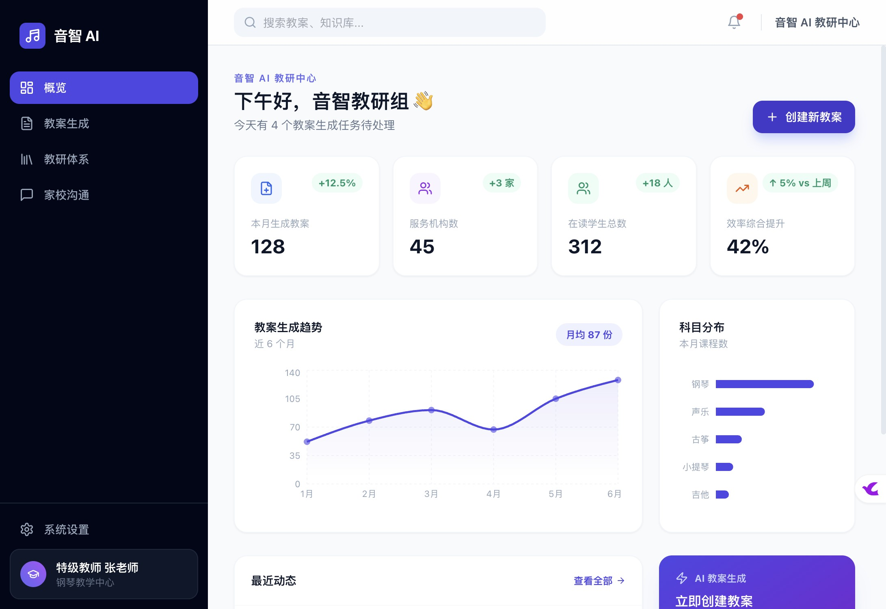

# 音智 AI · 智能教研 Copilot

> 专为全国音乐类艺培机构打造的 AI 智能教研副驾驶系统。通过大语言模型（LLM）+ RAG 技术，帮助音乐机构老板和一线教师实现**教案自动化生成、教研体系标准化管理、家校沟通智能化**三位一体的教学提效闭环。

📖 **[查看完整操作演示（Scribe）](https://scribehow.com/viewer/YinZhi_AI___DDyw4UFlRrCfzyz-wuybrw)**

---

## 🚀 快速使用（无需安装）

直接下载仓库中的 **`音智AI教研系统.html`**，双击用浏览器打开即可运行，无需 Node.js / npm / 服务器。

首次打开后：
1. 顶部出现黄色提示条 → 点「立即配置」进入设置页
2. 填入自己的 **API URL + API Key + 模型名**
3. 点「**测试连接**」→ 绿色通过后所有 AI 功能自动解锁
4. API Key 存储在本地浏览器，下次打开无需重填

> ⚠️ 需使用支持跨域（CORS）的 API 服务，推荐：OpenAI 官方 / DeepSeek / Moonshot / 智谱 AI

---

## 功能截图



---

## 功能模块

| 模块 | 功能说明 |
|------|---------|
| 📊 仪表盘 | 数据概览、6个月教案趋势图、科目分布柱状图、快捷入口 |
| 📝 教案生成 | 输入曲目 → AI 流式生成标准化教案 → Tiptap 富文本编辑 → PDF 导出 → 一键保存到教案库 |
| 📚 我的教案库 | 所有已保存教案，支持科目筛选 / 搜索 / 预览 / 一键复用重新生成 / 删除 |
| 🎓 大课包生成器 | 输入年龄段 / 课时数 / 教学体系，AI 生成完整课程体系大纲目录，支持导出 |
| 🗂 教研体系 | 教研文件上传与知识库管理，含各库健康度评分和完善度提示 |
| 💬 家校沟通 | 选学生 + 关键词 → AI 流式生成专业课后反馈文案 |
| 👤 学生管理 | 学生档案 / 学习进度 / 考级记录 / 表现标签（支持自定义，数据本地持久化） |
| ⚙️ 系统设置 | 自配置 API URL + Key + 模型，内置连接测试，通过后解锁全部 AI 功能 |

---

## 技术栈

| 层次 | 技术 |
|------|------|
| 框架 | Vite 4 + React 18 + TypeScript |
| 路由 | React Router DOM v6 |
| 样式 | Tailwind CSS 3 |
| 编辑器 | Tiptap v2 |
| 图表 | Recharts |
| PDF 导出 | jsPDF + html2canvas |
| AI 调用 | 自定义 streamChat()，SSE 流式输出，从 localStorage 读取用户 API 配置 |
| 打包 | vite-plugin-singlefile（单 HTML 文件，无需服务器） |

---

## 开发者本地启动

```bash
# 安装依赖
npm install

# macOS ARM64 需重签名原生二进制（其他平台跳过）
find node_modules -name "*.node" -exec codesign --force --sign - {} \;

# 启动开发服务器（端口 3000）
npm run dev
```

打开 [http://localhost:3000](http://localhost:3000)

```bash
# 打包成单 HTML 文件
npm run build
# 输出：dist/index.html（约 1.8MB，包含全部 JS/CSS）
```

---

## 更新日志

### v1.1.0
- 新增「智能大课包生成器」：按年龄段 / 课时数 / 教学体系生成完整课程大纲
- 新增「我的教案库」：教案自动存档，支持复用 / 预览 / 删除
- 新增「知识库健康度仪表盘」：各科目库完善度可视化评分
- 新增「学员表现标签」：学生详情支持添加自定义标签，持久化存储
- 系统设置全面升级：用户自配置 API，内置连接测试，通过后解锁 AI 功能
- 打包为单 HTML 文件，双击即可在浏览器运行，无需任何环境

### v1.0.0
- 仪表盘（Recharts 图表）
- 教案生成（AI 流式输出 + Tiptap 编辑器 + PDF 导出）
- 教研体系知识库管理
- 家校沟通（AI 流式文案生成）
- 学生管理
- 系统设置
